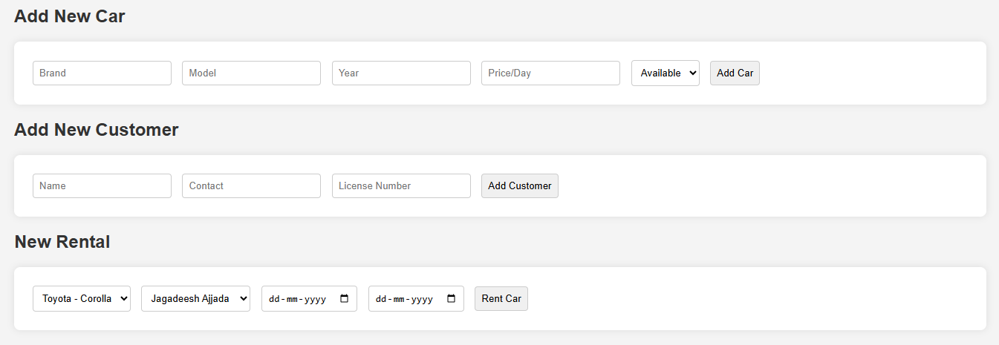
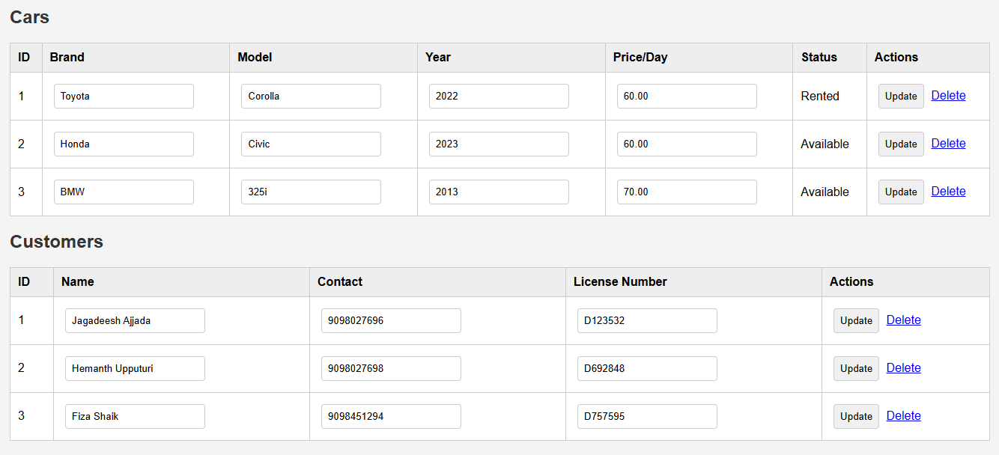
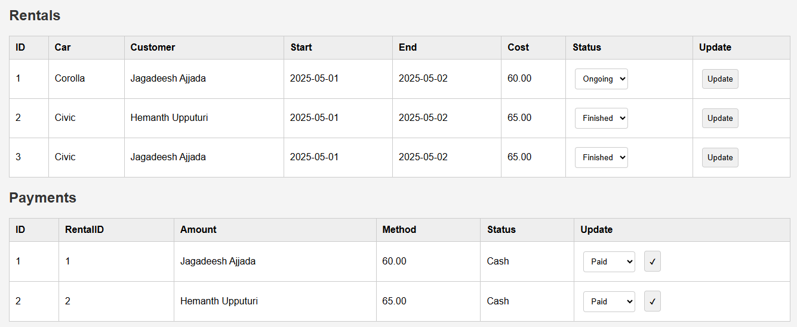

# Car Rental Management System

## Project Overview

This project implements a Car Rental Management System focusing on backend database design on MySQL. 

Core features include car and customer records, rental and payment tracking, and real-time status updates.

## Execution guide

Note: Must have python version 3.8 or more and pip also installed

- python -m venv venv
- pip install -r requirements.txt
- python app.py
- Open server in this mentioned local server `http://127.0.0.1:5000`

## Results

